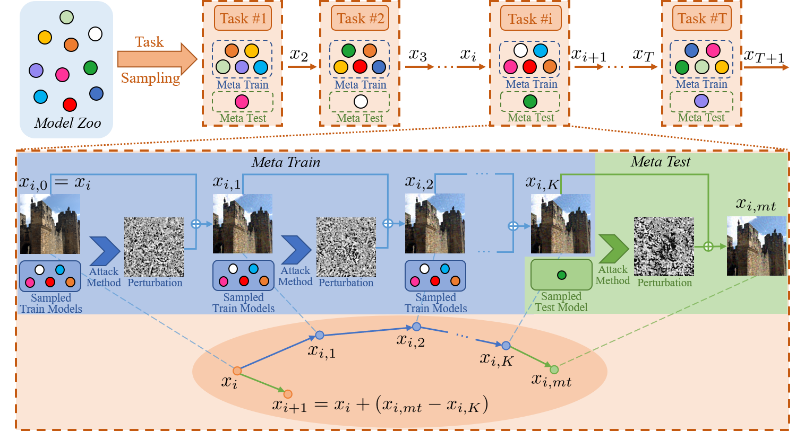

# Meta Gradient Adversarial Attack

This repository is an official implementation of the paper [Meta Gradient Adversarial Attack](https://arxiv.org/abs/2108.04204), which has been accepted by ICCV2021.

## Method

## Abstract
   In recent years, research on adversarial attacks has become a hot spot. Although current literature on the transfer-based adversarial attack has achieved promising results for improving the transferability to unseen black-box models, it still leaves a long way to go. Inspired by the idea of meta-learning, this paper proposes a novel architecture called Meta Gradient Adversarial Attack (MGAA), which is plug-and-play and can be integrated with any existing gradient-based attack method for improving the cross-model transferability. Specifically, we randomly sample multiple models from a model zoo to compose different tasks and iteratively simulate a white-box attack and a black-box attack in each task. By narrowing the gap between the gradient directions in white-box and black-box attacks, the transferability of adversarial examples on the black-box setting can be improved. Extensive experiments on the CIFAR10 and ImageNet datasets show that our architecture outperforms the state-of-the-art methods for both black-box and white-box attack settings.

## Usage
### Environment
    GPU: single GTX 1080Ti
    python: 3.6.5
    tensorflow: 1.9.0
    scipy: 1.1.0
    numpy: 1.14.3
    pandas: 1.1.5

### Model
We conduct the experiments with the widely used models trained on ImageNet.

For all the natural trained model, you can download them from [here](https://github.com/tensorflow/models/tree/master/research/slim).

For all the adversarial trained model, you can download them from [here](https://github.com/tensorflow/models/tree/archive/research/adv_imagenet_models).

After downloading all the model, please put them under the directory of `model`.

For some models, for the convenience of coding, we have made some adjustments to the variable names. In order to implement these changes, you can use the file `misc.py`.
- For `pnasnet-5_mobile_model_modify.ckpt`, we add variable scope of `pnasnet_mobile` before all variable names.  
- For `nasnet-a_mobile_model_modify.ckpt`, we add variable scope of `nasnet_mobile` before all variable names.  
- For `mobilenet_v2_1.4_224_modify.ckpt`, we replace variable scope of `MobilenetV2` with `MobilenetV2_1.4` at the beginning of the variable names.  
- For `adv_inception_v3_rename.ckpt`, we replace variable scope of `InceptionV3` with `AdvInceptionV3` at the beginning of the variable names.  
- For `ens3_adv_inception_v3_rename.ckpt`, we replace variable scope of `InceptionV3` with `Ens3AdvInceptionV3` at the beginning of the variable names.  
- For `ens4_adv_inception_v3_rename.ckpt`, we replace variable scope of `InceptionV3` with `Ens4AdvInceptionV3` at the beginning of the variable names.  
- For `ens_adv_inception_resnet_v2_rename.ckpt`, we replace variable scope of `InceptionResnetV2` with `EnsAdvInceptionResnetV2` at the beginning of the variable names.

### Running
    CUDA_VISIBLE_DEVICES=X bash run_attack.sh

The generated adversarial examples are saved under the directory of `outputs`, along with the evaluation results in `simple_eval_XXX.log`

## Citation
If you use our work in your research, please consider citing

    @article{yuan2021meta,
        title={Meta Gradient Adversarial Attack},
        author={Yuan, Zheng and Zhang, Jie and Jia, Yunpei and Tan, Chuanqi and Xue, Tao and Shan, Shiguang},
        journal={arXiv preprint arXiv:2108.04204},
        year={2021}
    }